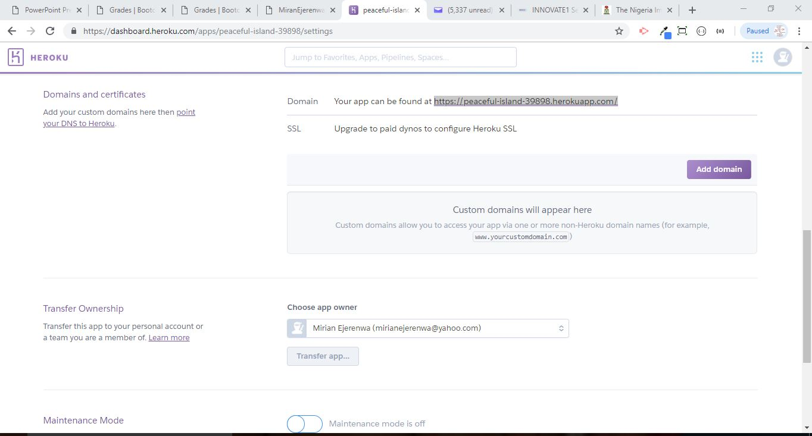
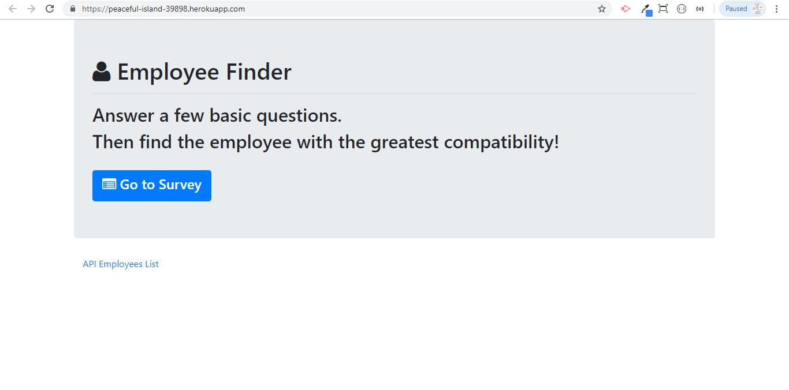
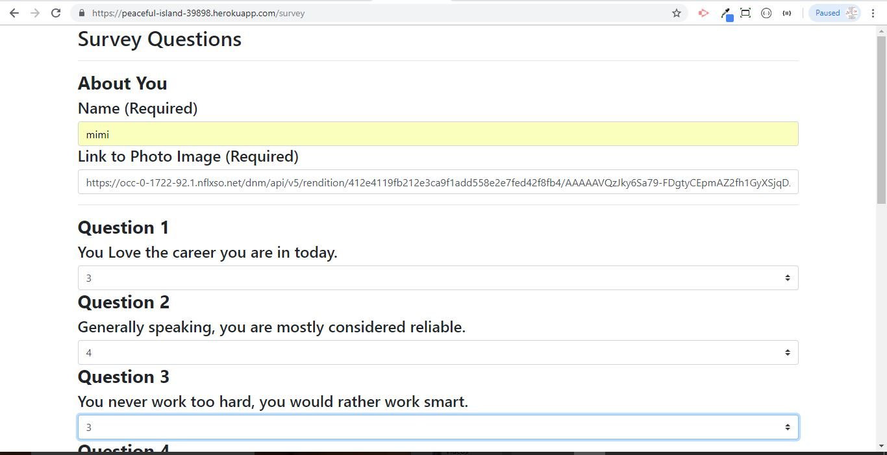
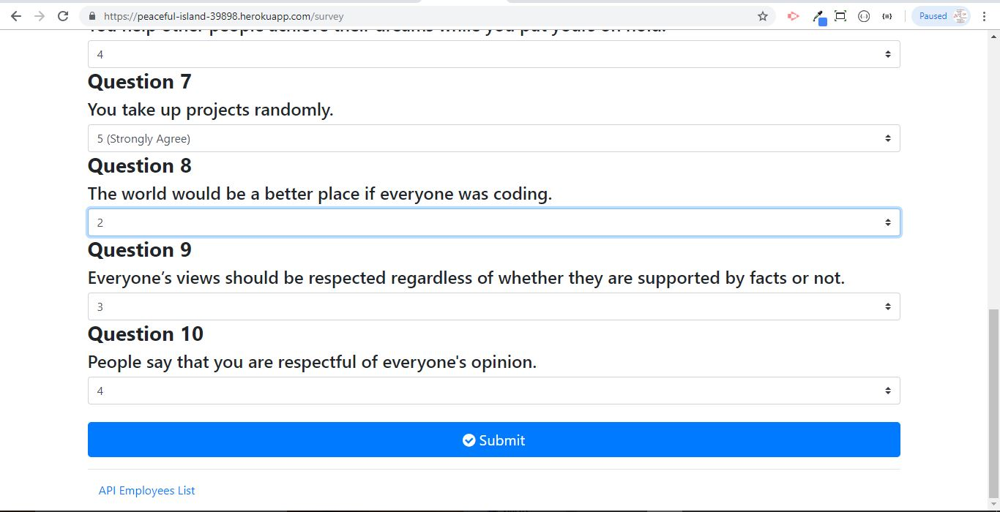
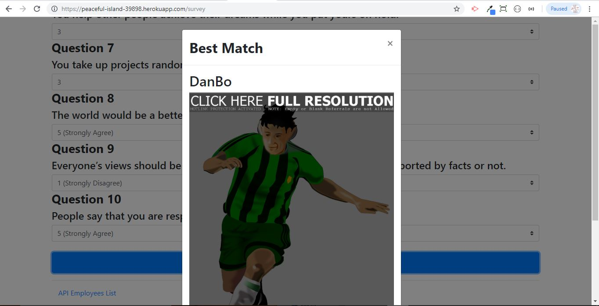
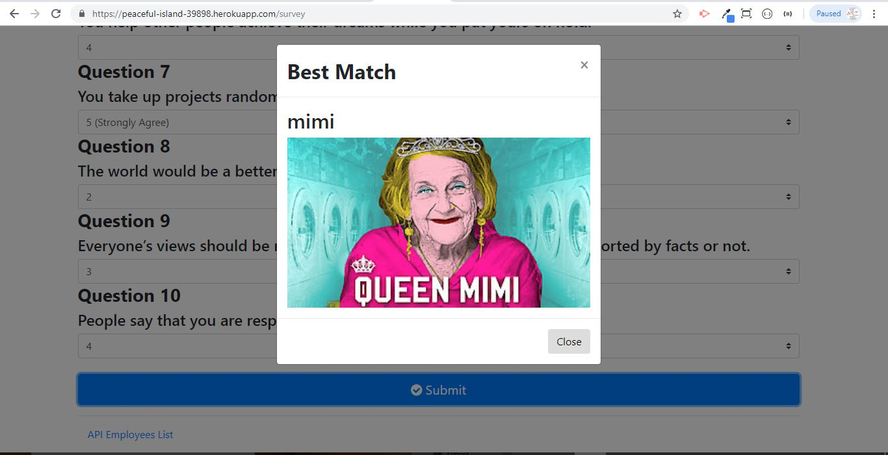
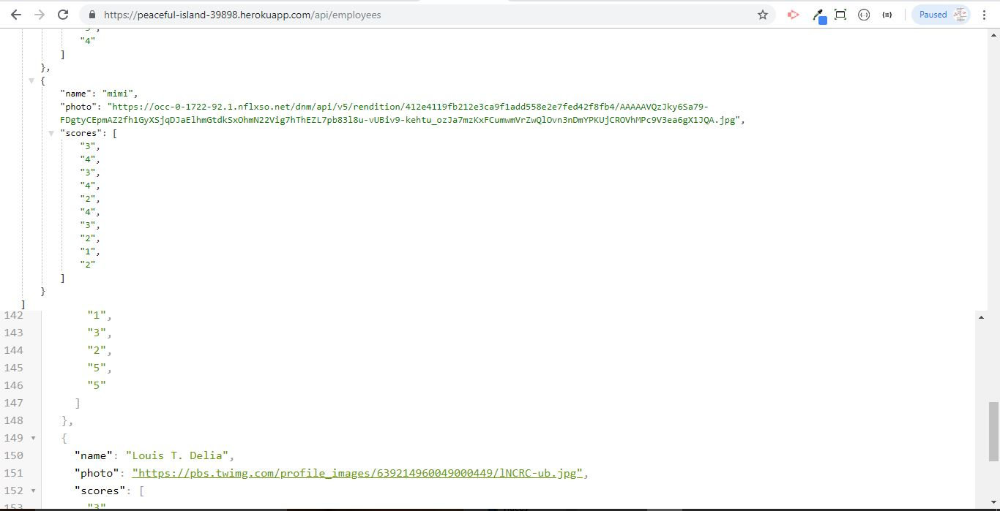

# **EmployeeFinder**

### **This full-stack site will take in results from your survey, compare the answers with other surveys within the array and then display the name and picture of the best match. **

**1. Here is the Domain on Heroku**

**2. Click Link to get to the Homepage**

**3. Complete the Survey**

**4. Submit Survey**

**5. Best Match found**

**6. Second best match if Submitted again**

**7. API Employee List**
